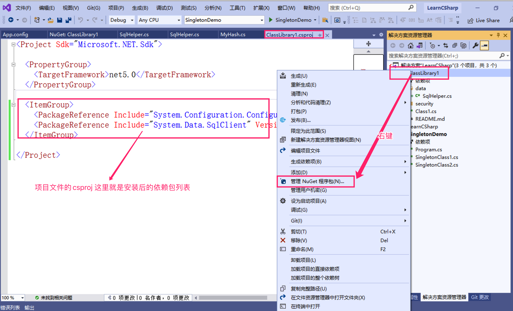
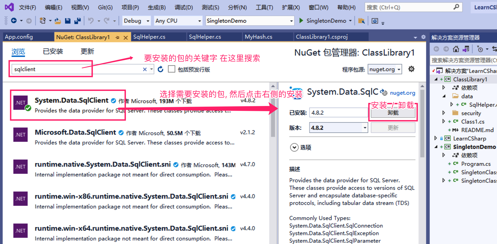
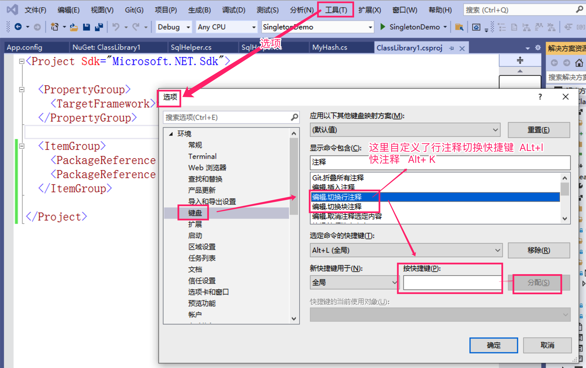

# .NET Core / .NET Framework / .NET Standard 
Microsoft  C#  .NET Core / .NET Framework / .NET Standard   learning  demo

NC  -->  NET Core  ---> C

NF  -->  NET Frameword  ---> F

NS  -->  NET Standard  ---> S

1.  项目目标框架创建后不可变更为其他框架,  只可以切换版本

2. 使用 .NET Framework 创建的类库 可以被 .NET Framework 或者 netCore的项目引用

3. 使用 .NET Standard创建的类库 不能被.NET Framework的项目引用, 只能被 大于等于自己版本的S和netcore项目引用

4. 但是 如果使用的是netcore创建的类库 是不能被 .NET Framework 项目引用的, 只能被netcore引用

5. 且使用最新.NET Framework 4.8创建的类库项目 也可以用于 netcore3.1的项目,貌似不受版本影响

6. 如果都是使用的 netcore的项目和类库,那使用类库的项目和类库项目的版本只能大于或者等于类库版本

7. 如果类库中使用了App.config 的配置信息, 则使用的时候调用类库所在项目的 App.config中的配置信息 

8. 如果是需要读取主项目中配置项目的类库最好是与主项目的目标框架一致; 如果是不需要读取主项目培训项目的类库可以使用 .NET Framework 这样可以兼容 NF 和 NC目标库调用

    

   如果要跨平台则必须使用 NC Net Core

## NuGet 程序 依赖包管理工具使用

先选中项目 然后 右键 --> 管理NuGet 程序包

## vs快捷键自定义

